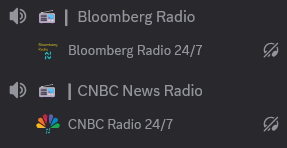

# CNBC & Bloomberg Streams

<figure><figcaption>
Radio bots stream audio 24/7
</figcaption></figure>

Each radio bot streams it's associated radio station 24/7, automatically joining a voice channel that contains the keyword `cnbc`or `bloomberg`in the channel name. It checks every hour for it's voice channel, so after inviting a bot, it may take up to 60 minutes for it to connect.

### Invite Bot

Bloomberg Radio Bot: [https://discord.com/oauth2/authorize?client\_id=1356307811855896606](https://discord.com/oauth2/authorize?client_id=1356307811855896606)

CNBC Radio Bot: [https://discord.com/oauth2/authorize?client\_id=1356357850473037985](https://discord.com/oauth2/authorize?client_id=1356357850473037985)
