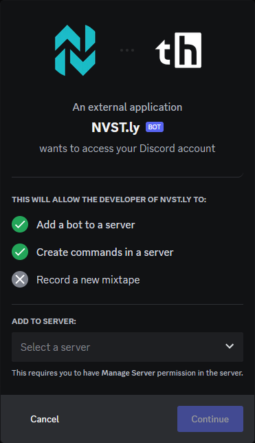

# Submit Trades

<figure><figcaption>
New Trade UI
</figcaption></figure>

## Explanation Of All Elements

### New Trade

**Market**\
\- Toggle between stocks, options, or crypto markets.\
\
**Position**\
\- Toggle for submitting a long or short trade.\
\
**Symbol**\
\- The ticker symbol of asset being submitted.\
\- When entering a ticker that our platform doesn't recognize, you will be prompted with an error and the option to report the missing ticker if you believe it is valid.\
\
**Pair** (crypto)\
\- The trading pair being used for trade, the 2nd ticker symbol. (I.e. BTC/USDT where USDT is the pair.)\
\
**Price**\
\- The price of your trade.\
\- A real-time price is auto-filled when a ticker symbol has been entered, which can be used to submit rather than inputting a price.


We check real-time prices when a trade is submitted, and allow a small threshold of how far you can be off the current market price to allow for volatility and time it takes when submitting a trade.


**Style Dropdown Menu**\
\- To mark your trade as daytrade, scalp, swing, or long term.

#### When options is toggled

**State**\
\- To select whether the trade is a call or put.\
\
**Exp. Date**\
\- Type in an expiration date or select one.\
\
**Strike**\
\- The strike price of your options contract.

<figure><figcaption>
Second &#x26; Optional Final Step of New Trade
</figcaption></figure>

**Take Profit & Stop Loss**\
\- Set TP and/or SL.\
\- Not required


Did you know?\
Trades will automatically close when your specified Take Profit or Stop Loss has been triggered. See more info regarding this feature LINK HERE


**Trade Notes**\
\- Include notes or _(soon)_ upload media.\
\- Not required\
\
**Sharing Settings**\
\- Auto share trade to your Discord webhooks or via Tweet.


Trade Sharing\
To add Discord webhooks or link your Twitter for automatic trade sharing, read more about [trade-sharing.md](../trade-sharing/trade-sharing.md "mention").


### Active Positions

<figure><figcaption>
Modify Active Positions
</figcaption></figure>

**Quick Close** .png>)\
\- Instantly close a position at it's current market price.\
\
**Status**\
\- Average, partial/trim, or close a position.\
\
**Price**\
\- Use the provided current market price or input your own\
\
**Trade Notes**\
\- Add optional notes or upload media.\
\
Share position update to Discord or Twitter. See [trade-sharing.md](../trade-sharing/trade-sharing.md "mention") for more info.

## How To Submit Stock Trades

### Opening

1. Hit the [New Trade](https://thetradehub.net/submit) button on navbar, for new users it automatically sets it to stock trades.
2. Select whether your trade is _Long_ or _Short._
3. Enter the stock ticker. _You will see it's logo appear and it's current price in the price box._
4. Put in your traded price, or leave it blank for current market price. _(Note: we allow a small tolerance the price can be off from current price to allow for volatility and time it takes to submit)_
5. _I am Opening_ will be the only option. _(unless you select an open position from the right side of display.)_
6. Select the style of your trade where _Daytrade_ is set as default. _(optional)_
7. Set your take profit or stop loss in the _TP/SL_ fields. _(optional)_
8. You can add notes in the _Notes_ field. _(optional)_
9. Hit the _Submit_ button

<figure><figcaption>
Leaving price blank will submit at current market price. Notes &#x26; TP/SL are optional.
</figcaption></figure>

### Average, Partial/Trim, or Closing

1. Select an open position from the right side of the [New Trade](https://thetradehub.net/submit) display, "Choose a position to modify".
2. Select _averaging, partialing, or closing_ from the dropdown menu after `I am`
3. Put in your traded price, or leave it blank for current market price.
4. You can add notes in the _Notes_ field. _(optional)_
5. Hit the _Submit_ button

<figure><figcaption>
Select from the dropdown menu whether to average up/down, partial close, or fully close the trade.
</figcaption></figure>


You can back out at any time by hitting the New Trade with red borders above the ticker field.


## How to Submit Options Trades

### Opening

1. Hit the [New Trade](https://thetradehub.net/submit) button on navbar, and select _Options_ at the top.
2. Select whether your trade is _Long_ or _Short._
3. Enter the stock ticker. Menus for expiration date, call/put, and strike price will appear.
4. Choose an expiration date from the drop down menu.
5. Select whether call or put.
6. Type in your strike price
7. Put in your traded price, or leave it blank for current market price. _(Note: we allow a small tolerance the price can be off from current price to allow for volatility and time it takes to submit)_
8. _I am Opening_ will be the only option. _(unless you select an open position from the right side of display.)_
9. Select the style of your trade where _Daytrade_ is set as default. _(optional)_
10. Set your take profit or stop loss in the _TP/SL_ fields. _(optional)_
11. You can add notes in the _Notes_ field. _(optional)_
12. Hit the _Submit_ button

<figure><figcaption>
Leaving price blank will submit at current market price. Notes &#x26; TP/SL ae optional.
</figcaption></figure>

### Average, Partial/Trim, or Closing

1. Select an open position from the right side of the [New Trade](https://thetradehub.net/submit) display, "Choose a position to modify".
2. Select _averaging, partialing, or closing_ from the dropdown menu after `I am`
3. Put in your traded price, or leave it blank for current market price.
4. You can add notes in the _Notes_ field. _(optional)_
5. Hit the _Submit_ button

<figure><figcaption>
Select from the dropdown menu whether to average up/down, partial close, or fully close the trade.
</figcaption></figure>


You can back out at any time by hitting the New Trade with red borders above the ticker field.


## How to Submit Crypto Trades


Currently disabled, only functional through Discord bot


### Opening

1. Hit the [New Trade](https://thetradehub.net/submit) button on navbar, and select _Crypto_ at the top.
2. Select whether your trade is _Long_ or _Short._
3. Enter the crypto ticker in the ticker field, and the trading pair with it. Don't use a `/` separator.
4. ~~Enter the traded pair in the pair field.~~
5. _I am Opening_ will be the only option. _(unless you select an open position from the right side of display.)_
6. Select the style of your trade where _Daytrade_ is set as default. _(optional)_
7. Select the exchange in the dropdown menu, it's set to Binance as default if this is your first submitted crypto trade.
8. Put in your traded price, or leave it blank for current market price. _(Note: we allow a small tolerance the price can be off from current price to allow for volatility and time it takes to submit)_
9. Set your take profit or stop loss in the _TP/SL_ fields. _(optional)_
10. You can add notes in the _Notes_ field. _(optional)_
11. Hit the _Submit_ button

<figure><figcaption>
Currently, unlike the Discord bot, a <code>/</code> separator is not required and won't work if used. Notes &#x26; TP/SL are optional
</figcaption></figure>

### Average, Partial/Trim, or Closing

### Until v2.0, crypto trades cannot be averaged, partialed, or closed through the New Trade feature on web app. This will need to be done through the Discord bot. See [closing-trades](../submit-crypto-trades-on-discord/closing-trades/ "mention")

1. ~~Select an open position from the right side of the~~ [~~New Trade~~](https://thetradehub.net/submit) ~~display, "Choose a position to modify".~~
2. ~~Select _averaging, partialing, or closing_ from the dropdown menu after `I am`~~
3. ~~Put in your traded price, or leave it blank for current market price.~~
4. ~~You can add notes in the _Notes_ field. _(optional)_~~
5. ~~Hit the _Submit_ button~~

## How to Submit Forex Trades

For now, forex trades can be submitted using the Stocks interface

### Opening

1. Hit the [New Trade](https://thetradehub.net/submit) button on navbar, for new users it automatically sets it to stock trades.
2. Select whether your trade is Long or Short.
3. Enter the forex symbol tickers. You will NOT see a logo appear, but it's current price in the price box will update.
4. Put in your traded price, or leave it blank for current market price. (Note: we allow a small tolerance the price can be off from current price to allow for volatility and time it takes to submit)
5. I am Opening will be the only option. (unless you select an open position from the right side of display.)
6. Select the style of your trade where Daytrade is set as default. (optional)
7. Set your take profit or stop loss in the TP/SL fields. (optional)
8. You can add notes in the Notes field. (optional)
9. Hit the Submit button

<figure><figcaption>
A <code>/</code> seperator is not required, and won't work if used. Notes &#x26; TP/SL are optional.
</figcaption></figure>

### Average, Partial/Trim, or Closing

1. Select an open position from the right side of the New Trade display, "Choose a position to modify".
2. Select averaging, partialing, or closing from the dropdown menu after _I am_
3. Put in your traded price, or leave it blank for current market price.
4. You can add notes in the Notes field. (optional)
5. Hit the Submit button

<figure><figcaption>
Select from the dropdown menu whether to average up/down, partial close, or fully close the trade.
</figcaption></figure>

## Changing TP/SL on open trades

TP/SL can be added or changed from the Trade Insight display. [#trade-insight-pop-ups-and-pages](../info/user-interfaces-overview.md#trade-insight-pop-ups-and-pages "mention")\
This ability will be available on this New Trade display in an upcoming version.

## Last Notes

Selections saved from the previous trade will be saved when you open the New Trade display to allow for better efficiency.
