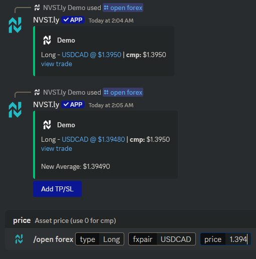

# Average Up/Down Positions

There is no extra trigger or syntax to average positions. Using the same opening submission for an existing trade that is still open will average the position.\
\
For example, if you submit `BTO USDCAD @ 1.395` and do not close it, when you submit another opening position the same as an existing one, such as `BTO AAPL @ 1.394,` it will already know you have an existing open trade for this ticker and will auto calculate the new average for this trade to 1.3945- the average of 1.394 & 1.395.

<figure><figcaption>
Example of averaging down
</figcaption></figure>

## Using Slash Commands

The same concept applies to slash commands as with text commands. Submitting an open position for the same existing open position will average it.

<figure><figcaption>
Example of averaging a position using slash command
</figcaption></figure>


Averages can't be 100% accurate due to the app not tracking position sizes. If only 1 unit is being traded, it will be 100%. The app only recognizes that order quantity is always 1, and it can't be specified otherwise. \
\
&#xNAN;_&#x41;n example of inaccuracy; trade opened with 5 units for $10.00, then averaged with 2 units  for $9.00 which creates a new average price of \~$9.71. The app only recognizes that 1 unit has been opened for $10.00, and 1 additional unit for $9.00- therefore calculating the average to $9.50._

