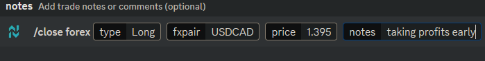

# Closing Trades


Closing triggers;\
**`STC`** is used to close long\
**`BTC`** is used to close short


### Closing Long

> **STC \<base & quote tickers> @ \<price>**\
> I.e. _`STC USDCAD @ 1.395`_

To close a **long** forex position, use the trigger **`STC`** followed by the base & quote tickers without separation, then the symbol @ before the price.

<figure><figcaption>
Example of closing a long position for USDCAD at the current market price of $1.3950
</figcaption></figure>

### Closing Short

> **BTC \<base & quote tickers> @ \<price>**\
> I.e. _`BTC USDCAD @ 1.395`_

To close a **short** forex position, use the trigger **`BTC`** followed by the base & quote tickers without separation, then the symbol **@** before the price.

<figure><figcaption>
Example of closing a short position for USDCAD at the price of $1.3950
</figcaption></figure>

##


Final Notes:\
\- **Do not use `$` with tickers.** \
**- Do not separate base & quote tickers with a `/` slash or any character.**\
\- Submit using a specified price, or use `CMP` or `M` for submitting at the current market price.\
\- Multiple trades can be submitted in a single message by using 3 back ticks (\`\`\`) before and after the whole message.


## Using Slash Commands

Submitting trades through slash commands has a more user friendly aspect to it but can take some seconds longer than text messages.

Type in `/close` then select `forex`.

Type in or select the direction `Long` or `Short`.&#x20;

Input the base and quote currency tickers, do not separate them with a `/` slash or any character.

Enter in the price or use `0` for the current market price.

Notes can be added and are optional. Trimming or partially closing positions can be done by using the Trim/Partial Close keywords (trim, trimming, partial, etc.) within the notes.

<figure><figcaption>
Example of closing a long position for USD/CAD at $1.395, with exit notes.
</figcaption></figure>


Did you know?\
Quickly closing trades can be done by using the `$list` or `/list` command to show all open trades, where each one has a button to immediately close it at the current market price. Check out [Broken link](broken-reference "mention") for a list of all commands and how to use them.

