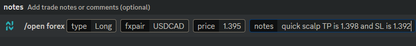

# Opening Trades


Opening triggers;\
**`BTO`** is used to open long\
**`STO`** is used to open short


### Opening Long

> **BTO \<base & quote tickers> @ \<price>**\
> I.e. _`BTO USDCAD @ 1.395`_

To open a **long** forex position, use the trigger **`BTO`** followed by the base & quote tickers without separation, then the symbol @ before the price.

<figure><figcaption>
Example of opening a long position for USD/CAD, at the current market price of $1.3950
</figcaption></figure>

### Opening Short

> **STO \<base & quote tickers> @ \<price>**\
> I.e. _`STO USDCAD @ 1.395`_

To open a **short** forex position, use the trigger **`STO`** followed by the base & quote tickers without separation, then the symbol **@** before the price.

<figure><figcaption>
Example of opening a short position for USD/CAD at the price of $1.395
</figcaption></figure>


Final Notes:\
\- **Do not use `$` with tickers.** \
**- Do not separate base & quote tickers with a `/` slash or any character.**\
\- Submit using a specified price, or use `CMP` or `M` for submitting at the current market price.\
\- Multiple trades can be submitted in a single message by using 3 back ticks (\`\`\`) before and after the whole message.


## Using Slash Commands

Submitting trades through slash commands has a more user friendly aspect to it but can take some seconds longer than text messages.

Type in `/open` then select `forex`.

Type in or select the direction `Long` or `Short`.

Input the base and quote currency tickers, do not separate them with a `/` slash or any character.

Enter in the price or use `0` for the current market price.

Notes can be added and are optional. Trade Styles (swing, scalp, etc.), Risk Factor Flags, and a Take Profit and/or Stop Loss can all be added by using the notes.

<figure><figcaption>
Example of opening a long position for USD/CAD at $1.3950, and setting both TP/SL.
</figcaption></figure>
